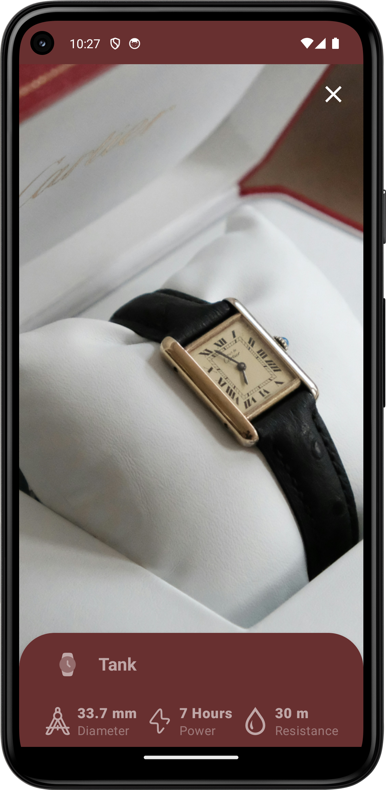

  <a href="https://github.com/pluzarev-nemanja/UpTime">
    
    <h1 align="center">UpTime ⌚</h1>
  </a>

## 🌐 About app

This is watch catalog app which uses Ktor server to get all informations about specific watch and its image.Also has search for watches and Ktor server is local hosted.

## 📱 Screenshots
### App Themes
|  |  | 
|:---:|:---:|
|Dark theme| Light theme|

### All screens
| | | | | ||
|:---:|:---:|:---:|:---:|:---:|:---:|
| Home | Search | Search | Details | Details | Details |

## 🧭 Navigation never been made easier 
Good interface with bottom bar menu.

## 🎨 Colorful
You can choose between two different main themes: White and Dark.It also implements Paletter Api in watch details screen so every watch has its own color scheme.

## 🏠 Home
Home tab is place where you can scroll through watch catalog and read about watches you like.

## 💡 Details
Detils screen is place where you can see full details about specific watch and its short history and origin.Details screen implements Palette Api which provides custom color scheme for every watch based on primary color of the watch image.

## 📦 Included Features
-  Base 2 themes (White,Dark)
-  Splash screen
-  Animations while navigating
-  Animated bottom bar with ball icon
-  Local cashing into database
-  Search screen
-  Details about watch
-  Custom watch rating widget
-  Internet connection needed only first time running app
-  Pagination through catalog
-  Test cases for custom UI components and functionalities of app
-  On boarding screens
-  Shimmer Effect

## 👨‍💻 Used technologies
-  Kotlin programming language
-  Jetpack Compose
-  Kotlin Flow
-  Kotlin coroutines
-  Room library
-  Dagger Hilt(dependency injection)
-  Coil(image loading library)
-  Clean architecture
-  MVVM design pattern
-  Use cases
-  Material 3 design
-  Splash screen API
-  Compose navigation
-  Ktor
-  Pager library
-  Retrofit
-  DataStore Preferences
-  KotlinX Serialization
-  Palette API
-  JUnit for testing
